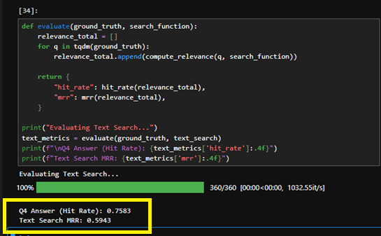
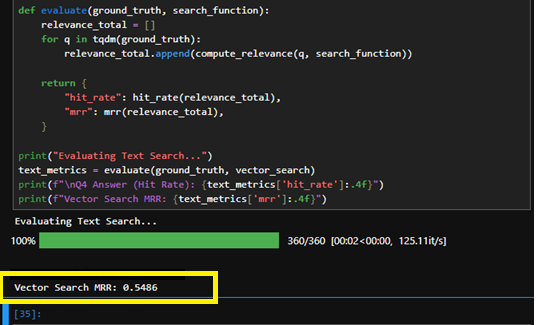
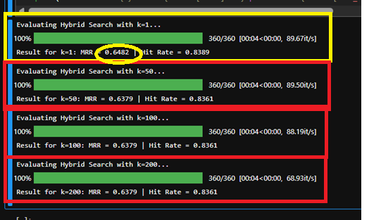

## LLM Zoomcamp 2026 Homework: Evaluation
## Christopher Guy Slater
## 2026-07-13

## Q1. Generating questions

Generating questions for all 72 pages costs money and takes time, so let's
start small and generate questions for just the first 3 pages:

- `01-agentic-rag/lessons/01-intro.md`
- `01-agentic-rag/lessons/02-environment.md`
- `01-agentic-rag/lessons/03-rag.md`

Each call returns the token usage, which most LLM APIs report on the response
object (e.g. `response.usage.input_tokens` / `prompt_tokens`).

What's the average number of input tokens across these 3 calls?

* 140
* ✅ 1400 ✅
* 14000
* 140000

## Q2. First result with text search

After running `text_search` for it, what's the `filename` of the first result?

* `01-agentic-rag/lessons/01-intro.md`
* ✅ `01-agentic-rag/lessons/03-rag.md` ✅
* `01-agentic-rag/lessons/13-function-calling.md`
* `01-agentic-rag/lessons/10-rag-next-steps.md`

## Q3. First result with vector search

After running `vector_search` for the same question, what's the `filename` of
the first result?

* ✅ `01-agentic-rag/lessons/01-intro.md` ✅
* `01-agentic-rag/lessons/03-rag.md`
* `04-evaluation/lessons/11-evaluation-intro.md`
* `04-evaluation/lessons/12-rag-answers.md`

## Q4. Evaluating text search

Evaluate `text_search` on the ground truth data.

What's the Hit Rate?

* 0.55
* 0.66
* ✅ 0.76 ✅
* 0.88

## Q5. Evaluating vector search

Now evaluate `vector_search` - the part we left for the homework, since the
module only evaluated keyword search.

What's the MRR?

* 0.35
* 0.45
* ✅ 0.55 ✅
* 0.65

## Q6. Tuning hybrid search

Evaluate `hybrid_search` over the full ground truth dataset for `k` values 1,
50, 100, and 200. Compare the MRR values for these runs.

Which `k` gives the best MRR?

* ✅ 1 ✅
* 50
* 100
* 200

